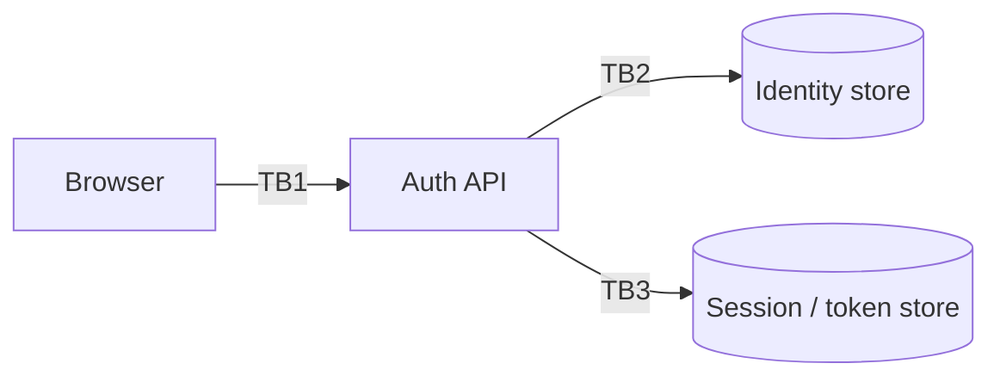

# Threat Model: <Auth / Session Feature Name>

> Pre-filled STRIDE worksheet for authentication and session features. Copy this file, rename, fill in.

## Scope

What auth/session feature is this — login, refresh, password reset, MFA enrolment, SSO callback?

## Diagram

## Trust boundaries

| ID | Crosses | Trust |
|---|---|---|
| TB1 | Anonymous internet → Auth API | none |
| TB2 | API → Identity store | server-side credentials |
| TB3 | API → Token store | server-side credentials |

## STRIDE walkthrough

### Spoofing

| # | Threat | Severity | Mitigation | Status |
|---|---|---|---|---|
| S-1 | Credential stuffing against /login | high | Per-IP + per-user rate limit, CAPTCHA after N failures, HIBP check on registration | |
| S-2 | Token forgery (alg:none, weak secret) | critical | Lock JWT algorithm; signing secret in vault; min 256-bit secret | |
| S-3 | Session-cookie theft via XSS | high | HttpOnly cookie + strict CSP | |

### Tampering

| # | Threat | Severity | Mitigation | Status |
|---|---|---|---|---|
| T-1 | Refresh-token theft via XSS / network | high | HttpOnly cookie + refresh-token rotation with reuse detection | |
| T-2 | Tampering with role claim in JWT | critical | Signature verify with HS256/RS256; never trust unsigned claims | |

### Repudiation

| # | Threat | Severity | Mitigation | Status |
|---|---|---|---|---|
| R-1 | User claims they didn't enable MFA | low | Audit log: actor, action, timestamp, IP | |

### Information disclosure

| # | Threat | Severity | Mitigation | Status |
|---|---|---|---|---|
| I-1 | Email enumeration via login error messages | medium | Identical response for "wrong password" vs "no such user"; constant-time-ish | |
| I-2 | Email enumeration via password-reset endpoint | medium | Always 200 with same message regardless of email existence | |

### Denial of service

| # | Threat | Severity | Mitigation | Status |
|---|---|---|---|---|
| D-1 | Account-lockout DoS by brute-forcing wrong passwords for a target user | medium | **Don't** lock accounts; rate-limit + CAPTCHA + alert | |

### Elevation of privilege

| # | Threat | Severity | Mitigation | Status |
|---|---|---|---|---|
| E-1 | Role injection via OAuth state parameter | high | State is opaque server-issued nonce; never carries claims | |
| E-2 | MFA bypass via legacy login flow | high | Disable legacy auth (basic / IMAP / POP); require MFA on every flow | |

## Out of scope

- Password storage (assumes Argon2 / bcrypt is in place — see [chapter 2](https://github.com/batuhan-satilmis/owasp-saas-hardening-guide/blob/main/chapters/02-cryptographic-failures.md)).
- Provider-side breach (we trust the IdP's security model).

## Open questions

- [ ]

## Sign-off

- Author:
- Reviewer:
- Date:
