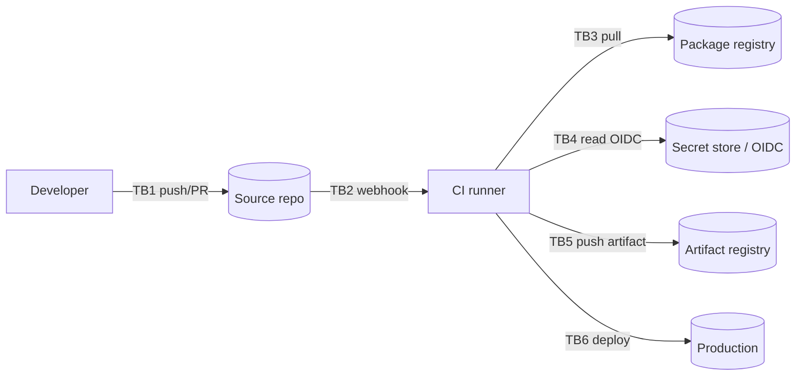

# Threat Model: <CI/CD Pipeline / Supply Chain Feature Name>

> Pre-filled STRIDE worksheet for build/release pipelines and their dependencies. CI/CD is a trusted-relationship asset (MITRE T1199): it holds production credentials, signs artifacts that get deployed, and pulls third-party code on every run. Compromise of the pipeline is compromise of every deployed environment — Codecov (2021), SolarWinds (2020), and the xz-utils backdoor (2024) are the canonical examples. Use this template for any change that touches workflow files, runners, secrets, or dependency manifests.

## Scope

Which pipeline (CI provider + repo), which branches and tags trigger it, which secrets it consumes, what artifacts it produces, and where those artifacts are deployed. Be explicit about the *blast radius* — a pipeline that pushes to prod has a wider model than one that only runs lint.

## Diagram

## Trust boundaries

| ID | Crosses | Trust |
|---|---|---|
| TB1 | Developer (or fork contributor) → Source repo | authenticated; commit content is hostile when from forks / new contributors |
| TB2 | Source repo → CI runner | event-triggered; payload includes attacker-controllable PR title, branch name, file contents |
| TB3 | CI runner → Package registry | network egress; pulled dependencies execute install scripts in the runner |
| TB4 | CI runner → Secret store | short-lived OIDC token preferred over long-lived PATs |
| TB5 | CI runner → Artifact registry | service identity; artifacts should be signed (cosign / Sigstore) |
| TB6 | Artifact → Production deploy | verified signature + provenance attestation before rollout |

## STRIDE walkthrough

### Spoofing

| # | Threat | Severity | Mitigation | Status |
|---|---|---|---|---|
| S-1 | Attacker opens PR from a fork that triggers a privileged workflow (the classic `pull_request_target` / `pwn_request` pattern) | critical | Default to `pull_request` (no secrets); for any `pull_request_target` workflow, never check out and run untrusted PR code; require maintainer approval for first-time contributors | |
| S-2 | Typosquatted dependency (`reqeusts`, `loadsh`, `colourama`) pulled on install and runs in the build | high | Lockfiles pinned by hash (`pip install --require-hashes`, `npm ci`, `yarn install --frozen-lockfile`); allow-list registries; review every new dependency | |
| S-3 | Self-hosted runner re-used across jobs leaks an SSH agent / kube-context from a prior job | high | Ephemeral runners (one job per VM); reset `$HOME`, kube-context, and gcloud/aws config between jobs | |

### Tampering

| # | Threat | Severity | Mitigation | Status |
|---|---|---|---|---|
| T-1 | Malicious commit to a third-party action — `uses: foo/bar@v1` resolves to a mutable tag the attacker rewrote | critical | Pin all third-party actions to a commit SHA (`uses: foo/bar@a1b2c3d…`); Dependabot keeps them current with human review | |
| T-2 | Branch-protection bypass: attacker pushes directly to `main` because a privileged token (admin PAT, release bot) sidesteps required reviews | high | Branch protection enforced for everyone including admins; release automation uses a bot identity that itself must open a PR | |
| T-3 | Build script modified in a PR injects `curl … \| sh` during a step that runs with secrets | critical | Required reviews on any change under `.github/workflows/**`, `Dockerfile*`, `Makefile`, `*.sh`; CODEOWNERS gate on these paths | |
| T-4 | Cached dependency poisoned — attacker writes a malicious wheel/binary into the build cache during a benign-looking job, served to later jobs | high | Cache scoped to `${{ github.ref }}` and never to PRs; cache key includes lockfile hash; treat cached binaries as untrusted on restore | |

### Repudiation

| # | Threat | Severity | Mitigation | Status |
|---|---|---|---|---|
| R-1 | A deploy goes to prod and no one can point to "who approved this build of what commit" | high | Provenance attestation (SLSA Build L2+) stored with the artifact; deploy record links commit SHA → artifact digest → deployer identity → time | |
| R-2 | Audit logs of workflow runs deleted by the same admin who ran the malicious job (T1070, T1562.008) | medium | Stream CI audit logs off-platform (SIEM); retention ≥ 90 days; integrity protection on the SIEM side | |

### Information disclosure

| # | Threat | Severity | Mitigation | Status |
|---|---|---|---|---|
| I-1 | Secret printed by a debug `set -x` / `echo $TOKEN` in a workflow step | high | CI provider's secret-masking is best-effort, not authoritative — review every `set -x`, redirect stderr in steps that handle secrets, use OIDC instead of long-lived secrets so a leaked token expires in minutes | |
| I-2 | Build log uploaded as a public artifact contains `~/.aws/credentials`, `.npmrc`, `.netrc` | high | `actions/upload-artifact` allow-list of paths; never upload `$HOME` or `$GITHUB_WORKSPACE` wholesale | |
| I-3 | `printenv` or core-dump from a failing step leaks the entire job environment in a public log | medium | Never `printenv` in a public-log job; route diagnostic dumps to a private bucket with short TTL | |
| I-4 | Long-lived PAT in a repo secret continues to work after the contributor who created it leaves | high | OIDC short-lived federation to cloud and registries; quarterly audit of remaining static secrets with owners | |

### Denial of service

| # | Threat | Severity | Mitigation | Status |
|---|---|---|---|---|
| D-1 | Fork PR opens 100 expensive matrix jobs to exhaust the org's CI minutes | medium | Concurrency group cancels in-flight runs on the same ref; max-parallel cap on the matrix; require maintainer approval for fork workflow runs | |
| D-2 | Upstream registry outage (npm, PyPI, Docker Hub) wedges every deploy | medium | Pull-through cache or internal mirror for required dependencies; documented break-glass path that skips the cache | |
| D-3 | Compromised post-`npm install` script forks bombs the runner or exfils through DNS | high | Egress allow-list on runners (registries + cloud APIs only, DNS to a logged resolver); CPU/memory limits per job | |

### Elevation of privilege

| # | Threat | Severity | Mitigation | Status |
|---|---|---|---|---|
| E-1 | Default `GITHUB_TOKEN` has write access to the repo by default — a malicious script in the workflow rewrites a branch, opens a release, or adds a deploy key | critical | `permissions: contents: read` at the workflow root; grant `write` only to the specific job/scope that needs it | |
| E-2 | Workflow uses `${{ github.event.pull_request.title }}` (or branch name, or body) directly in a shell step → script injection (T1059) | critical | Never interpolate untrusted event fields into a shell — bind to an `env:` first and reference `"$VAR"`; treat the entire PR webhook payload as attacker-controlled | |
| E-3 | Self-hosted runner runs as root with Docker socket mounted → container escape to runner host | high | Rootless runner; no `/var/run/docker.sock` mount; container builds delegated to a sandboxed builder (BuildKit rootless or kaniko) | |
| E-4 | A trusted third-party action turns malicious in a later version (the "compromise an upstream maintainer" path — see xz-utils CVE-2024-3094) | critical | Pin to SHA (T-1); review the diff on every bump; alert on new contributor accounts inside dependency-bot PRs; subscribe to the dependency's advisory feed | |
| E-5 | OIDC trust policy in cloud is too broad — `repo:org/*:ref:refs/heads/main` lets every repo deploy to prod | high | OIDC subject claims pinned to the *specific* repo and environment; require `environment:` reviewers on `production` | |

## Required controls

- [ ] All third-party actions pinned to a commit SHA, not a tag
- [ ] `permissions:` block at the workflow root, default to `contents: read`
- [ ] OIDC federation to cloud / registries instead of long-lived secrets where supported
- [ ] CODEOWNERS gate on `.github/workflows/**`, `Dockerfile*`, build scripts
- [ ] Lockfiles enforced (`--require-hashes`, `npm ci`, equivalent)
- [ ] Ephemeral runners; no state shared between jobs
- [ ] Egress allow-list on runners (block arbitrary DNS exfil paths)
- [ ] SLSA Build L2+ provenance on every artifact destined for production
- [ ] Signed artifacts (cosign / Sigstore) with signature verified at deploy time
- [ ] CI audit logs streamed off-platform with ≥ 90-day retention
- [ ] Quarterly review of repo secrets and OIDC trust policies

## Out of scope

- Source-code review of the application being built (covered by the per-feature threat model).
- Runtime application security in production (covered by the production hardening guide).

## Open questions

- [ ] Which jobs in this pipeline are allowed to touch production credentials, and is that scoped to the smallest possible jobset?
- [ ] If a maintainer account is compromised today, what's the path from "attacker has PR-merge rights" → "attacker has signed artifact in prod"? How many human reviews does it cross?

## References

- [SLSA framework](https://slsa.dev/) — supply-chain provenance levels.
- [`incident-response-playbook` → 05-web-application-compromise](https://github.com/batuhan-satilmis/incident-response-playbook/blob/main/runbooks/05-web-application-compromise.md) — first 15 minutes when CI is the suspected initial-access vector includes pausing CI to prevent re-introduction.
- [`owasp-saas-hardening-guide` → A08 Software & Data Integrity Failures](https://github.com/batuhan-satilmis/owasp-saas-hardening-guide/blob/main/chapters/08-software-data-integrity.md) — control catalog the mitigations above reference.
- [GitHub: Security hardening for GitHub Actions](https://docs.github.com/en/actions/security-guides/security-hardening-for-github-actions) — vendor guidance; the `pwn_request` and script-injection patterns above come from real advisories there.

## Sign-off

- Author:
- Reviewer:
- Date:
