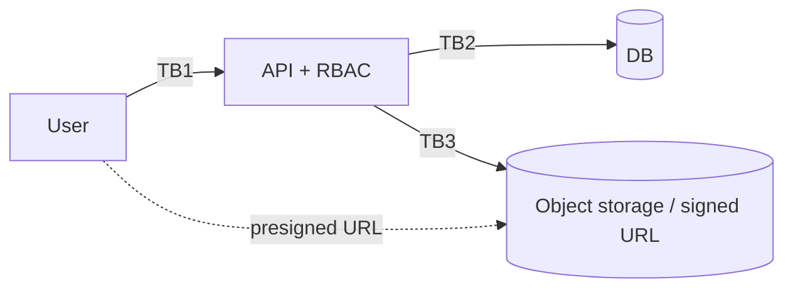

# Threat Model: <Data Export Feature Name>

> Pre-filled STRIDE worksheet for data-export / report-download endpoints. Data egress is the path most likely to leak PII *with* legitimate authentication.

## Scope

Which export endpoint, which fields, which formats (CSV, JSON, PDF)?

## Diagram

## Trust boundaries

| ID | Crosses | Trust |
|---|---|---|
| TB1 | User → API | session + role verified |
| TB2 | API → DB | server-side credentials |
| TB3 | API → Object storage | server-side credentials; presigned URLs short-lived |

## STRIDE walkthrough

### Spoofing

| # | Threat | Severity | Mitigation | Status |
|---|---|---|---|---|
| S-1 | Anonymous access to presigned URL after sharing | medium | Short TTL (≤ 5 min) on presigned URLs; one-time use where possible | |

### Tampering

| # | Threat | Severity | Mitigation | Status |
|---|---|---|---|---|
| T-1 | URL parameter manipulation to expand scope | high | Export filter validated server-side; tenant_id from JWT only | |

### Repudiation

| # | Threat | Severity | Mitigation | Status |
|---|---|---|---|---|
| R-1 | Insider claims they didn't perform a large export | medium | Audit log: actor, scope, row count, timestamp, IP | |

### Information disclosure

| # | Threat | Severity | Mitigation | Status |
|---|---|---|---|---|
| I-1 | Export contains soft-deleted records | high | Export query explicitly excludes `deleted_at IS NOT NULL` | |
| I-2 | Export contains fields not visible in UI | high | Field-level allow-list per export type; reviewed at design time | |
| I-3 | PII spilled in CSV column never intended for export | high | Default-deny field list; new fields require explicit opt-in | |
| I-4 | Cross-tenant data via export endpoint | critical | RLS enforces tenant scope at DB layer | |

### Denial of service

| # | Threat | Severity | Mitigation | Status |
|---|---|---|---|---|
| D-1 | Massive export blows up DB | medium | Page size cap; async with email-link pattern for large exports | |

### Elevation of privilege

| # | Threat | Severity | Mitigation | Status |
|---|---|---|---|---|
| E-1 | `viewer` role exports data they can't see in UI | high | RBAC check: export requires same or higher role than the underlying read | |

## Compensating controls

- DLP rule on egress: alerts if outbound export contains > N records or known-sensitive patterns.
- Rate limit per user: > N exports / hour triggers alert.
- Anomaly detection: an account that normally exports 5/month suddenly exports 5,000.

## Open questions

- [ ]

## Sign-off

- Author:
- Reviewer:
- Date:
