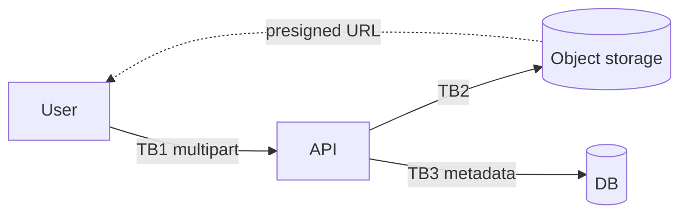

# Threat Model: <File Upload Feature Name>

> Pre-filled STRIDE worksheet for file-upload / media-handling features. File handling is a notorious source of RCE, SSRF, and stored-XSS bugs.

## Scope

What's uploaded, by whom, where stored, who can read it back?

## Diagram

## Trust boundaries

| ID | Crosses | Trust |
|---|---|---|
| TB1 | User → API | authenticated; uploaded bytes are hostile |
| TB2 | API → Object storage | service credentials |
| TB3 | API → DB | service credentials |

## STRIDE walkthrough

### Spoofing

| # | Threat | Severity | Mitigation | Status |
|---|---|---|---|---|
| S-1 | User uploads file claiming to belong to another user | high | API binds upload to session.user_id, ignores client-supplied owner | |

### Tampering

| # | Threat | Severity | Mitigation | Status |
|---|---|---|---|---|
| T-1 | MIME type spoofing (HTML uploaded as image.png) | high | Content-type detection by magic bytes server-side, not by extension or client header | |
| T-2 | Filename traversal (`../../etc/passwd`) | high | Strip path; generate server-side filename (UUID); never write to a user-controlled path | |

### Repudiation

| # | Threat | Severity | Mitigation | Status |
|---|---|---|---|---|
| R-1 | User claims they didn't upload offending content | medium | Audit log per upload: actor, hash, size, timestamp | |

### Information disclosure

| # | Threat | Severity | Mitigation | Status |
|---|---|---|---|---|
| I-1 | Uploaded file readable by other tenants via guessable URL | high | Presigned URLs scoped to tenant; private bucket; no public-read ACL | |
| I-2 | EXIF metadata leaks GPS / device info | medium | Strip EXIF on upload (or warn the user) | |
| I-3 | Verbose errors leak storage bucket name / region | low | Sanitize errors; client gets opaque code + request ID | |

### Denial of service

| # | Threat | Severity | Mitigation | Status |
|---|---|---|---|---|
| D-1 | Zip bomb / archive that decompresses to GBs | high | Size cap before decompression; refuse archives where ratio > threshold | |
| D-2 | Many large files exhaust storage quota | medium | Per-tenant quota; alert at 80% | |

### Elevation of privilege

| # | Threat | Severity | Mitigation | Status |
|---|---|---|---|---|
| E-1 | RCE via image processing (ImageMagick CVEs) | critical | Pinned, patched image library; processing in a sandboxed worker | |
| E-2 | Stored XSS via SVG (SVG can contain `<script>`) | high | Reject SVG, or sanitize via DOMPurify server-side and serve with `Content-Disposition: attachment` | |
| E-3 | Server-Side Request Forgery via "import from URL" feature | high | DNS resolved server-side, IP validated against public-only allow-list (see [SSRF chapter](https://github.com/batuhan-satilmis/owasp-saas-hardening-guide/blob/main/chapters/10-ssrf.md)) | |

## Required controls

- [ ] Magic-byte content-type validation
- [ ] Server-issued filename (no user input)
- [ ] Size cap enforced *before* full read
- [ ] Pre-decompression size check for archives
- [ ] EXIF strip for images (or explicit user warning)
- [ ] Anti-virus / sandbox scan if accepting executables / docs from external users
- [ ] `Content-Disposition: attachment` for any user-uploaded HTML/SVG

## Out of scope

- Client-side preview rendering (assumes browser sandbox).

## Open questions

- [ ]

## Sign-off

- Author:
- Reviewer:
- Date:
