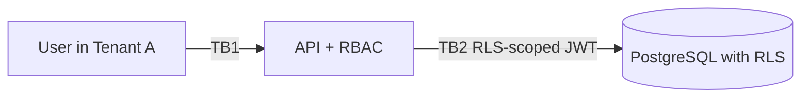

# Threat Model: <Multi-Tenant Feature Name>

> Pre-filled STRIDE worksheet for B2B SaaS features that touch tenant-scoped data. Tenant isolation is the single most-tested boundary for B2B.

## Scope

Which feature, which tables / resources, which roles can read/write?

## Diagram

## Trust boundaries

| ID | Crosses | Trust |
|---|---|---|
| TB1 | Authenticated user → API | session verified; tenant_id derived from JWT |
| TB2 | API → DB | RLS forces tenant_id filter regardless of query |

## STRIDE walkthrough

### Spoofing

| # | Threat | Severity | Mitigation | Status |
|---|---|---|---|---|
| S-1 | User spoofs `tenant_id` via request body | high | API ignores client-supplied tenant_id; reads from JWT | |
| S-2 | UUID guessing of cross-tenant resource IDs | medium | Server-issued UUIDv4; RLS prevents data leak even if guessed | |

### Tampering

| # | Threat | Severity | Mitigation | Status |
|---|---|---|---|---|
| T-1 | Modify resource ID in URL/body to access another tenant's record | critical | RLS policy `WHERE tenant_id = jwt.tenant_id` (FORCE) | |
| T-2 | Privilege-escalation via tampered role claim | high | Role read from server-issued JWT, never from client | |

### Repudiation

| # | Threat | Severity | Mitigation | Status |
|---|---|---|---|---|
| R-1 | Tenant_admin claims they didn't change settings | low | Audit log entry per privileged action | |

### Information disclosure

| # | Threat | Severity | Mitigation | Status |
|---|---|---|---|---|
| I-1 | Cross-tenant read via missing `WHERE tenant_id` | critical | Defense in depth: API filter + DB RLS + integration test that probes Tenant B as Tenant A | |
| I-2 | Aggregate-stats endpoint leaks tenant fingerprint | medium | Aggregate endpoints scoped to single tenant; no cross-tenant counts in user-facing APIs | |

### Denial of service

| # | Threat | Severity | Mitigation | Status |
|---|---|---|---|---|
| D-1 | Tenant runs unbounded query that affects others (noisy neighbor) | medium | Per-tenant rate limits; query timeouts; statement-level resource caps | |

### Elevation of privilege

| # | Threat | Severity | Mitigation | Status |
|---|---|---|---|---|
| E-1 | Role escalation within a tenant via unprotected admin endpoint | high | Per-route `requireRole()` — declared explicitly per endpoint | |
| E-2 | Service-role JWT used in client code by mistake | critical | Lint rule blocks service-role key in client bundle; service role only used in API server | |

## Required automated tests

- Integration test: as Tenant A, attempt to read every row of every table; expect only Tenant A's rows.
- Integration test: as `viewer`, attempt every admin-only endpoint; expect 403.

## Open questions

- [ ]

## Sign-off

- Author:
- Reviewer:
- Date:
