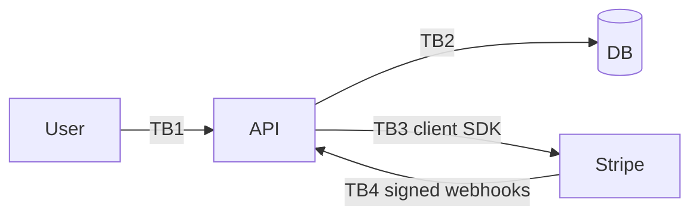

# Threat Model: <Payment / Billing Feature Name>

> Pre-filled STRIDE worksheet for payment / billing flows. Stripe handles PCI; **you** handle the order of operations, and that's where most exploits live. See [forsman-crm-showcase/THREAT-MODEL.md](https://github.com/batuhan-satilmis/forsman-crm-showcase/blob/main/THREAT-MODEL.md) for a worked example.

## Scope

Subscribe / cancel / refund / change-plan / chargeback / invoice download — list every payment-touching path.

## Diagram

## Trust boundaries

| ID | Crosses | Trust |
|---|---|---|
| TB1 | User → API | session verified |
| TB2 | API → DB | server-side credentials |
| TB3 | API → Stripe | restricted secret key |
| TB4 | Stripe → API webhook endpoint | signed events only; replay-checked |

## STRIDE walkthrough

### Spoofing

| # | Threat | Severity | Mitigation | Status |
|---|---|---|---|---|
| S-1 | Forged webhook event credits paid plan | high | `stripe.webhooks.constructEvent` signature verify on every event | |
| S-2 | Client supplies stripe_customer_id directly | medium | Customer ID resolved from session, not request body | |

### Tampering

| # | Threat | Severity | Mitigation | Status |
|---|---|---|---|---|
| T-1 | Modify amount in /subscribe request body | high | Amount derived server-side from plan_id; client never supplies amount | |
| T-2 | Race two /subscribe requests; one charge, two subscriptions | medium | Idempotency keys + DB unique constraint on (tenant_id, stripe_subscription_id) | |
| T-3 | Cancel in UI but Stripe call fails silently → continue billing | high | Cancellation persisted only after Stripe ack; daily reconciliation alerts on drift | |

### Repudiation

| # | Threat | Severity | Mitigation | Status |
|---|---|---|---|---|
| R-1 | User claims unauthorized refund | low | Audit log + Stripe ledger | |

### Information disclosure

| # | Threat | Severity | Mitigation | Status |
|---|---|---|---|---|
| I-1 | Webhook payloads logged with PII | medium | Log event ID + type only; redact known-sensitive fields | |
| I-2 | Stripe API key in error stack trace | high | SDK pinned to scrubbing version; logger redacts `sk_*` strings | |

### Denial of service

| # | Threat | Severity | Mitigation | Status |
|---|---|---|---|---|
| D-1 | Webhook flood at /webhooks/stripe | low | Edge rate-limit; signature verify is fast and rejects unsigned traffic before DB | |

### Elevation of privilege

| # | Threat | Severity | Mitigation | Status |
|---|---|---|---|---|
| E-1 | Replay successful event for another tenant | medium | Signed-event ledger; tenant derived from event payload's customer_id, not URL/header | |
| E-2 | Cross-tenant customer-ID collision | critical | Constraint: a stripe_customer_id maps to exactly one tenant; webhook handler enforces | |

## Out of scope

- Card data handling (delegated to Stripe; we never see PANs).
- Stripe-side breach (we trust their security model).

## Open questions

- [ ]

## Sign-off

- Author:
- Reviewer:
- Date:
