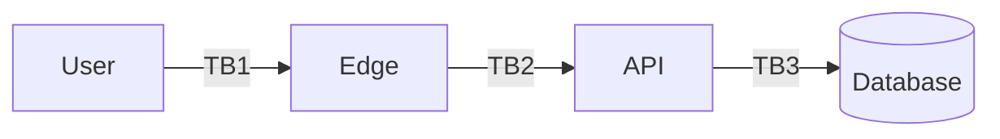

# Threat Model: <Feature Name>

> STRIDE worksheet. Fill out in a 30-minute session with the engineer building the feature, ideally also a security peer.

## Scope

Describe what the feature does in 1-3 sentences. Identify the assets it handles.

## Diagram

A simple data-flow diagram (DFD). Mermaid is fine, ASCII is fine, a Whimsical link is fine.

## Trust boundaries

| ID | Crosses | Trust assumption |
|---|---|---|
| TB1 | Anonymous internet → Edge | none |
| TB2 | Edge → API | session cookie verified |
| TB3 | API → DB | parameterized queries; RLS |

## STRIDE walkthrough

For each row: describe the threat in one line, decide severity, list mitigation, decide status.

### Spoofing — pretending to be someone you aren't

| # | Threat | Severity | Mitigation | Status |
|---|---|---|---|---|
| S-1 | | | | |

### Tampering — modifying data in transit or at rest

| # | Threat | Severity | Mitigation | Status |
|---|---|---|---|---|
| T-1 | | | | |

### Repudiation — being able to deny doing something

| # | Threat | Severity | Mitigation | Status |
|---|---|---|---|---|
| R-1 | | | | |

### Information Disclosure — leaking data

| # | Threat | Severity | Mitigation | Status |
|---|---|---|---|---|
| I-1 | | | | |

### Denial of Service — making the system unavailable

| # | Threat | Severity | Mitigation | Status |
|---|---|---|---|---|
| D-1 | | | | |

### Elevation of Privilege — gaining capability you shouldn't have

| # | Threat | Severity | Mitigation | Status |
|---|---|---|---|---|
| E-1 | | | | |

## Out of scope

Be explicit about what's not in this analysis.

## Open questions

- [ ]
- [ ]

## Sign-off

- Author:
- Reviewer:
- Date:
